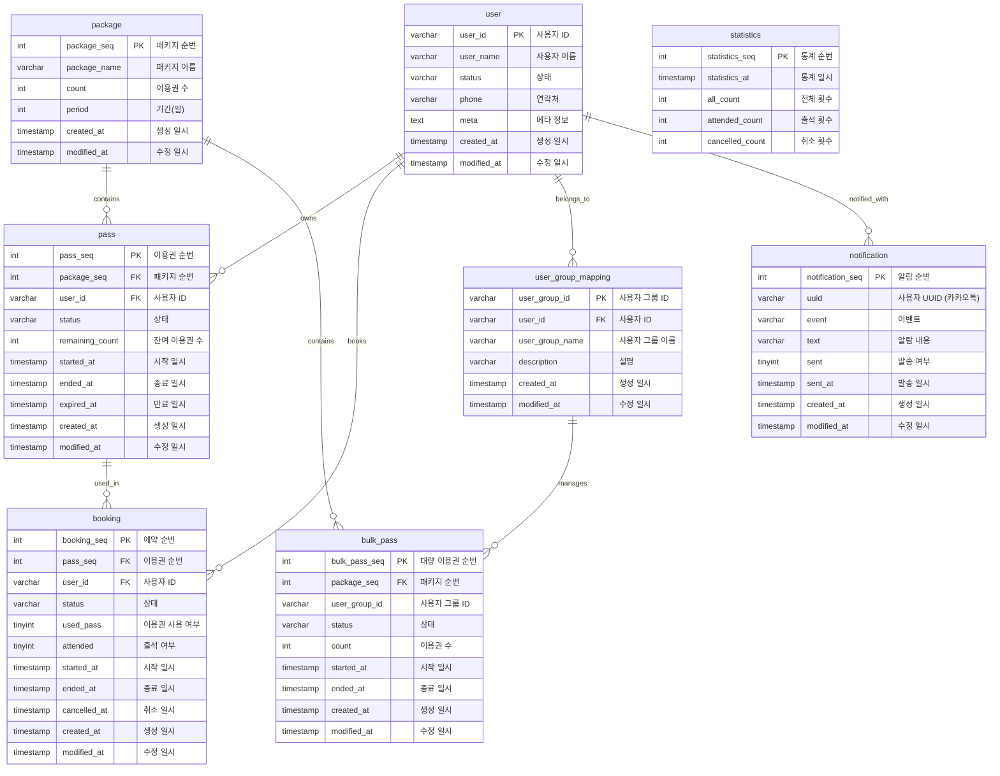

# PT 이용권 서비스

**PT 이용권 서비스**는 개인 또는 그룹 이용자에게 PT 이용권을 관리하고 예약 및 알림 기능을 제공하는 시스템입니다. 이 프로젝트는 Spring Boot와 MySQL을 기반으로 하며, 사용자와 이용권의 효율적인 관리 및 통계 기능을 제공합니다.

## 주요 기능

- **이용권 관리**: 다양한 패키지의 이용권을 생성하고, 사용자의 개별 이용권 및 그룹 이용권을 관리합니다.
- **예약 시스템**: 이용권을 기반으로 PT 세션 예약 기능을 제공하며, 예약 시 출석 및 취소 내역을 기록합니다.
- **알림 기능**: 사용자가 예약 정보를 받을 수 있도록 알림을 전송하는 기능을 제공합니다.
- **통계 관리**: 서비스 사용 횟수, 출석 및 취소 데이터를 기반으로 통계 정보를 제공합니다.

## 기술 스택

- **Backend**: Java, Spring Boot
- **Database**: MySQL
- **ORM**: JPA
- **API Documentation**: Swagger (추가 예정)
- **Containerization**: Docker, Docker Compose

## 데이터베이스 구조

프로젝트의 주요 테이블 구조는 다음과 같습니다:

1. **package** - PT 이용권 패키지 정보를 저장합니다.
2. **pass** - 사용자에게 발급된 개별 이용권을 관리합니다.
3. **bulk_pass** - 사용자 그룹에게 발급된 대량 이용권을 관리합니다.
4. **booking** - 이용권을 사용하여 예약한 PT 세션 정보를 저장합니다.
5. **user** - 사용자 정보 관리 테이블입니다.
6. **notification** - 알림 전송 및 상태를 관리합니다.
7. **statistics** - 이용 통계를 기록합니다.


<details>
    <summary>ERD</summary>
    

Mermaid 다이어그램을 통해 각 테이블 간 관계를 시각적으로 표현해 보겠습니다. 다음은 Mermaid의 ERD 코드와 함께 각 테이블 간 관계를 설명한 것입니다.

### Mermaid ERD 코드


### 설명

1. **`package`와 `pass`, `bulk_pass`**:  
   `package` 테이블은 여러 `pass`와 `bulk_pass`를 포함할 수 있습니다. `package_seq`를 통해 각각의 이용권(`pass`)과 대량 이용권(`bulk_pass`)에 연결됩니다.

2. **`pass`와 `booking`**:  
   `pass` 테이블은 `booking` 테이블과 연결되어 있으며, 각 이용권(`pass`)이 여러 예약(`booking`)에 사용될 수 있습니다. 이 관계는 `pass_seq`를 통해 이루어집니다.

3. **`user`와 `pass`, `booking`, `notification`**:  
   `user` 테이블은 각각의 사용자가 자신의 이용권(`pass`), 예약(`booking`), 알림(`notification`)을 소유할 수 있는 관계입니다. 이를 통해 `user_id`를 기준으로 사용자가 여러 이용권, 예약, 알림을 가질 수 있습니다.

4. **`user_group_mapping`과 `bulk_pass`**:  
   `user_group_mapping`은 사용자 그룹과 관련된 정보를 저장하며, `bulk_pass`를 통해 특정 사용자 그룹에게 대량 이용권을 제공하는 구조입니다. `user_group_id`를 통해 이 관계가 설정됩니다.

5. **`statistics`**:  
   `statistics`는 시스템 사용 통계와 관련된 정보를 저장하며, 출석 횟수 및 취소 횟수 등을 기록합니다. 이는 다른 테이블과 직접 연결되지는 않지만, 통계 데이터를 수집하기 위한 목적으로 사용됩니다.

각 테이블은 주요 필드를 가지고 있으며 관계형 데이터베이스에서 필요한 외래 키(`FK`)를 통해 연결되어 있습니다.

</details>

## 실행 방법

1. **Docker** 설치:
    - 이 프로젝트는 Docker로 배포됩니다. Docker가 설치되어 있는지 확인합니다.

2. **Docker Compose 실행**:
   ```bash
   docker-compose up -d --build
